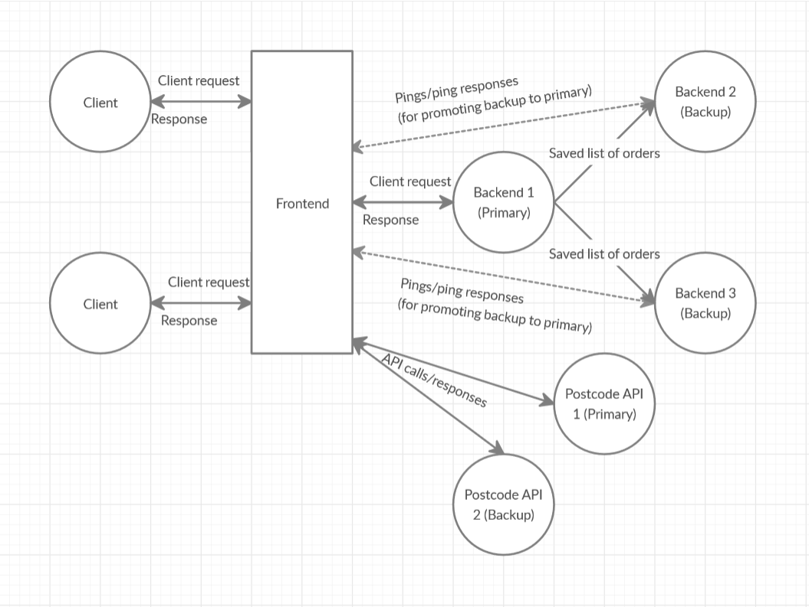

# Just Hungry - Pyro4 Distributed System

This project implements a fault-tolerant distributed system, called "Just Hungry", based on passive replication, supporting online food ordering and delivery.

This implementation consists of up to three back-end servers (this number can be changed) one front-end server, and a client.

The backend servers accept, process, and make responses to user orders. They fulfil location, relocation, replication, and failure transparency requirements.

The front-end server provides one system access, preventing the client from having direct access to individual system components and supporting transparency requirements.

The client program allows the user to access the system by making food ordering requests and receiving system responses.

External Web Services are also incorporated to support delivery address confirmation of postal code. This implementation treats the Web Services as distributed system components and fulfils suitable transparency requirements, much like the backend servers.

The following system design diagram illustrates the major workflows between the components of the distributed system.

